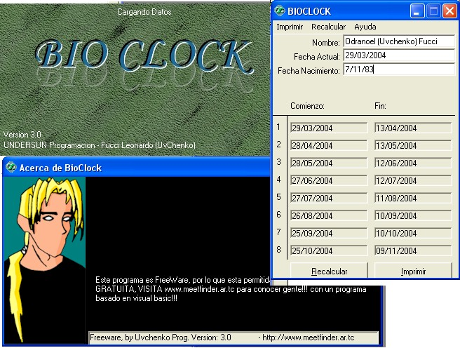

<div align="center">

## \[     A\- BioRRitm    \]


</div>

### Description

It calculates the days when your body is up to do somethings like Diet, gym, etc. and get excelent results... also it tells you on wich days the results will be better.
 
### More Info
 
Your Name, and BirthDay

a from....to 14 days, where you Biorritm is working. there you will be up to do somethings..


<span>             |<span>
---                |---
**Submitted On**   |2004-03-29 04:26:22
**By**             |[FUCCI, Leonardo Hernan](https://github.com/Planet-Source-Code/PSCIndex/blob/master/ByAuthor/fucci-leonardo-hernan.md)
**Level**          |Beginner
**User Rating**    |3.7 (26 globes from 7 users)
**Compatibility**  |VB 4\.0 \(32\-bit\), VB 5\.0, VB 6\.0
**Category**       |[Complete Applications](https://github.com/Planet-Source-Code/PSCIndex/blob/master/ByCategory/complete-applications__1-27.md)
**World**          |[Visual Basic](https://github.com/Planet-Source-Code/PSCIndex/blob/master/ByWorld/visual-basic.md)
**Archive File**   |[BioRRitm1725853292004\.zip](https://github.com/Planet-Source-Code/fucci-leonardo-hernan-a-biorritm__1-52715/archive/master.zip)

### API Declarations

```
UNDERSUN Programacion:::...
By Fucci, Leonardo Hernan (UvChenko)
see www.meetfinder.ar.tc for knowing people with my programm!!!
```


